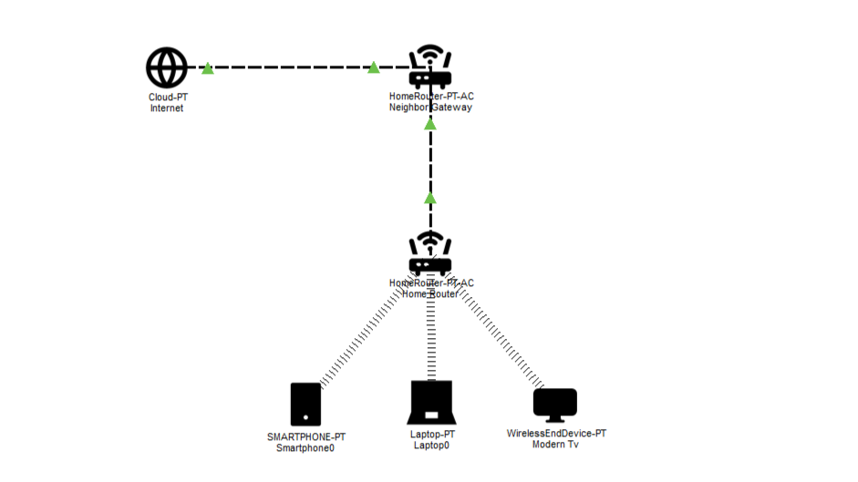

# HOME NETWORK LAB
  a documentation and troubleshooting project based on my home network.

## Objectives
  - understand how a typical home network is structured
  - analyze Wi-Fi configuration
  - practice IP addressing and subnetting
  - understand DHCP and DNS
  - practice basic network troubleshooting
  - document problems and their solutions

## Network Environment
  - Internet Service Provider: MyRepublic
  - Internet connection: shared connection
  - Upstream router: neighbor's router
  - Connection to upstream router: Ethernet
  - Cable: SPECTRA CAT5e FTP
  - Local Router: Tenda F3
  - Wireless standard: IEEE 802.11b/g/n, only support 2.4 GHz
  - Client devices: laptop, smartphones, smart TV

