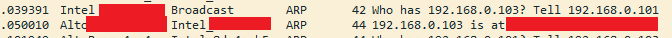

# ARP

## Objective
  To understand how devices within a local area network (LAN) discover and communicate with each other.

## View and deleting the ARP cache on Windows
  In cmd use `arp` to displays and modifies the IP-to-Physical address translation tables used by
  address resolution protocol (ARP).
  - `arp -a` used to display current ARP table:
    
    ```
    Interface: 192.168.0.101 --- 0x4
    Internet Address      Physical Address      Type
    192.168.0.1           xx-xx-xx-xx-xx-00     dynamic
    192.168.0.103         xx-xx-xx-4a-xx-xx     dynamic
    224.0.0.22            xx-xx-xx-xx-xx-xx     static
    ...
    ```
  - `arp -d` used to delete all hosts. But we can specified it's address like: `arp -d 192.168.0.103`

    ```
    arp -a

    Interface: 192.168.0.101 --- 0x4
    Internet Address      Physical Address      Type
    192.168.0.1           xx-xx-xx-xx-xx-0x     dynamic
    224.0.0.22            xx-xx-xx-xx-xx-xx     static
    ...
    ```
    see the host with an IP address `192.168.0.103` is now gone.
    > need an administrator access to delete ARP cache

## Wireshark
  After deleting connection with `192.168.0.103`, I try to ping it. 
  Then the traffic shows my laptop make an ARP request to the entire network
  asking for `192.168.0.103`'s MAC address
  
  

### ARP Request
  ```
  Address Resolution Protocol (request)
    Hardware type: Ethernet (1)
    Protocol type: IPv4 (0x0800)
    Hardware size: 6
    Protocol size: 4
    Opcode: request (1)
    Sender MAC address: Intel_8d:4e:b5 (aa:bb:cc:dd:ee:ff)
    Sender IP address: 192.168.0.101
    Target MAC address: 00:00:00_00:00:00 (00:00:00:00:00:00)
    Target IP address: 192.168.0.103
  ```
  The destination is broadcast and the target is unknown because my laptop doesn't know where to sent
  but it knows the target IP is in the same networks.
### ARP Reply
  ```
  Address Resolution Protocol (reply)
    Hardware type: Ethernet (1)
    Protocol type: IPv4 (0x0800)
    Hardware size: 6
    Protocol size: 4
    Opcode: reply (2)
    Sender MAC address: AltoX_xx:xx:e1 (xx:xx:xx:xa:xx:xx)
    Sender IP address: 192.168.0.103
    Target MAC address: Intel_8d:4e:b5 (aa:bb:cc:dd:ee:ff)
    Target IP address: 192.168.0.101
  ```

