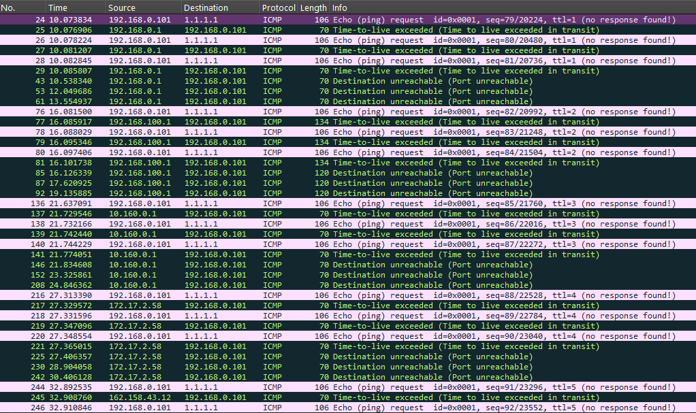

# TRACEROUTE

## Objective
  To observe how packets travel from the local network to an Internet destination and identify the Layer 3 hops along the path.

## Test Environment
  * Source IP: `192.168.0.101`
  * Destination: Router, device in the same network and `1.1.1.1`
  * Tool: Windows `tracert`
  * Packet analyzer: Wireshark
  * Protocol observed: ICMP

## Pinging Local Network
  In this section I try to find how packet travel in router and a device in the local network, and I use TV.
  It will be the same?

  I tested with the condition my laptop only have router's mac address info
  ```
  Internet Address      Physical Address      Type
  192.168.0.1           xx-xx-xx-xx-xx-00     dynamic
  192.168.0.255         ff-ff-ff-ff-ff-ff     static
  224.0.0.22            xx-xx-xx-xx-xx-xx     static
  ```
  
  with the command: `ping <Target IP>`

  The wireshark shows:
  - Both destination addresses are the device IP addresses that I am trying to ping.
  - Both TTL(Time to Live) request values are 128 and the reply are 64,
    it indicates the packet did not pass through a hop.
  - But since my laptop doesn't know the TV MAC address,
    it first request an ARP message to the boardcast to ask it's MAC address.
    After the TV replies. It then continued with an ICMP requests.
 
## Tracing an Internet

  ```cmd
  tracert 1.1.1.1
  ```

## Observation
  The process sends ICMP probes with increasing TTL values.
  
  The captured packets showed the following path:
  | TTL | Responding Host | Response              |
  | :-: | --------------- | --------------------- |
  |   1 | `192.168.0.1`   | Time-to-live exceeded |
  |   2 | `192.168.100.1` | Time-to-live exceeded |
  |   3 | `10.0.0.1`      | Time-to-live exceeded |
  |   4 | `4.4.118.170`   | Time-to-live exceeded |
  |   5 | `162.158.43.12` | Time-to-live exceeded |
  |   6 | `162.158.43.45` | Time-to-live exceeded |
  |   7 | `1.1.1.1`       | Echo reply            |

## How Traceroute Works
  Traceroute uses the TTL field in the IP header to discover routers along the path.
  
  The first probe is sent with TTL 1.

  When the first router processes the packet, the TTL reaches zero. 
  The router discards the packet and sends an ICMP Time-to-live exceeded message back to the source.

  Traceroute then increases the TTL and sends another probe.
  
  ```
  TTL 1 → stops at hop 1
  TTL 2 → stops at hop 2
  TTL 3 → stops at hop 3
  ...
  TTL 7 → reaches the destination
  ```
  This allows the source device to identify the routers along the path.

## Relationship With The Routing Table
  The local routing table contains:
  ```
  0.0.0.0/0 → 192.168.0.1
  ```
  This is the default route.

  Because `1.1.1.1` is outside the local network `192.168.0.0/24`, 
  the laptop sends the packet toward the default gateway `192.168.0.1`.

## TTL Observation
  A normal `ICMP` ping to `1.1.1.1` showed:
  - Echo Request TTL: 128
  - Echo Reply TTL: 57

  The traceroute probes are different because their TTL values are intentionally set to low values such as 1, 2, 3, and so on.

  The `TTL` values used by traceroute should not be confused with the TTL of a normal ping.

## Key Findings
  - The laptop uses `192.168.0.1` as its default gateway.
  - `192.168.0.1` is the first hop toward the Internet.
  - `192.168.100.1` appears as the next hop in the upstream network.
  - Increasing `TTL` values allow traceroute to discover successive hops.
  - `ICMP` Time-to-live exceeded responses are part of the traceroute mechanism and do not necessarily indicate a network failure.
  - The destination `1.1.1.1` was reached after the observed intermediate hops.



> Wireshark capture showing ICMP traceroute probes with increasing TTL values and the corresponding ICMP Time-to-live exceeded responses.
