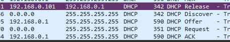
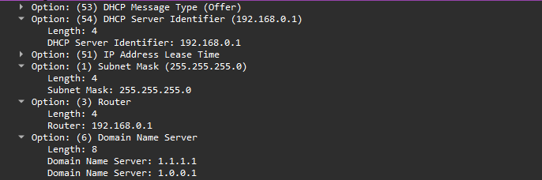

# DHCP Lease Test

## Objective
  The objective of this experiment is to observe how a device can have their own IP address 
  and other configurations without need user to manually configure it one by one.

## DHCP Configuration
  ```
  IPv4 Address    : 192.168.0.101
  Subnet Mask     : 255.255.255.0
  Default Gateway : 192.168.0.1
  DHCP Server     : 192.168.0.1
  DNS Server      : 1.1.1.1 / 1.0.0.1
  DHCP Enabled    : Yes
  ```

## 1. What Happen If I Erase Network Configuration In My Laptop?
  By using `ipconfig /release` we can achieve that. It will erase all IP configured by DHCP on our device.

  

  Interestingly the laptop will notice that they are connected to a network but don't have an IP address. 
  
  Then it sends out a DHCP Discover message to find any available DHCP servers. 
  But since it doesn't know where to send the message, it shouts to the entire network.

  DHCP server --router, in this case-- it responds with a DHCP Offer message containing a proposed configuration.
  
  

  The laptop recieve the offer. It then sends a DHCP Request message to formally claim that specific IP. 
  But the source still `0.0.0.0` (the address requested is not official until the next step).

  The reouter receives the request, finalizes the lease in its database, 
  and sends a DHCP ACK (Acknowledge) message back to the laptop.
  
---
### What I learned

  - DHCP provides network configuration to clients.
  - DHCP can provide the client's IP address, subnet mask, default gateway, DNS server, and lease duration.
