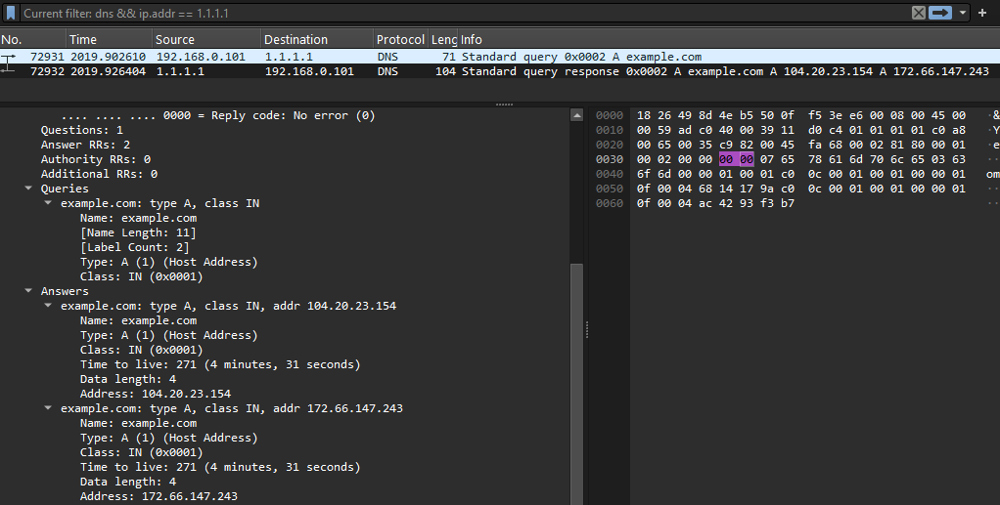

# DNS Resolution

## Objective
  The objective of this experiment is to understand how a device uses DNS to translate a domain name into an IP address.


## Environment
  * Operating System: Windows
  * Network connection: Wi-Fi
  * DNS Server: `1.1.1.1` / `1.0.0.1`
  * Packet analysis tool: Wireshark

## 1. DNS Resolution with nslookup
  The first thing to do before getting started is to delete dns cache from the laptop. By using `ipconfig /flushdns` and rebooting the restart the router.
  
  The `nslookup` command was used to query the IP address of a domain.

  ```cmd
  nslookup example.com
  ```
  ```
  Server:  one.one.one.one
  Address:  1.1.1.1

  Non-authoritative answer:
  DNS request timed out.
      timeout was 2 seconds.
  Name:    example.com
  Addresses:  104.20.23.154
              172.66.147.243
  ```

  Then I tested if those IP are really be used when I tried to looking for the same domain:

  ```
  ping example.com

  Pinging example.com [172.66.147.243] with 32 bytes of data:
  Reply from 172.66.147.243: bytes=32 time=16ms TTL=58
  ...
  ``` 

## 2. A and AAAA Records
  Specific DNS record types were queried separately:

  ```cmd
  nslookup -type=A example.com
  ```

  and:

  ```cmd
  nslookup -type=AAAA example.com
  ```  
  
## 3. DNS Packet Capture

  

  The captured traffic contained DNS query and response packets.

  The DNS query contained the requested domain name, while the DNS response contained the answer returned by the DNS server.

  The DNS traffic observed in this experiment used UDP port `53`.

## Observations
  - The laptop can use a domain name without knowing its IP address beforehand.
  - DNS resolves the domain name into an IP address.
  - A DNS query can return multiple IP addresses.
  - `A` records are used for IPv4 addresses.
  - `AAAA` records are used for IPv6 addresses.
  - DNS query and response packets can be observed using Wireshark.
  - The DNS server address was provided to the laptop through network configuration obtained from DHCP.

---
### What I Learned 
  DNS acts as a name-resolution system between human-readable domain names and IP addresses.

DHCP and DNS have different roles:

  - **DHCP** provides network configuration, including the DNS server address.
  - **DNS** resolves domain names into IP addresses.
  - **Routing** determines how packets reach the resulting IP address.

