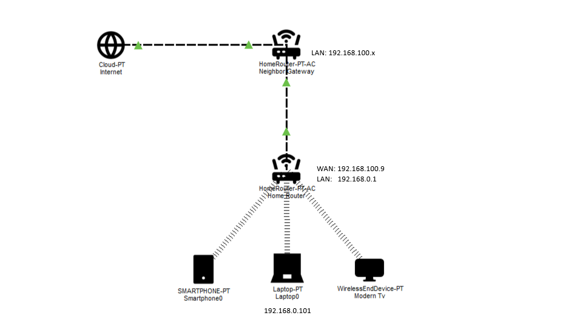

# NETWORK INVENTORY

## Network Devices

|    Device   |       Role     | Connection | Private IP Address  |        Notes         |
|---|---|---|---|---|
| ISP Gateway | Upstream gateway  | Fiber | 192.168.100.1  | Located at neighbor's house |
| Home Router | Local router   | Ethernet | 192.168.0.1  | Provides local network access |
| Smart TV    | Client/End device | Wi-Fi | TBD            | Wireless client             |
| Smartphones | Client/End device | Wi-Fi | TBD            | Wireless client             |
| Laptop      | Client/end device | Wi-Fi | 192.168.0.101  | Main workstation            |

## Physical Connection
  The home network receives its upstream connection from a neighboring
  network through a Cat5e FTP Ethernet cable.

  The cable connects the upstream network to the home router.

## Cable Information
  - Manufacturer: SPECTRA
  - Category: Cat5e
  - Type: FTP(Foiled twisted pair)
  - Conductor: 24 AWG
  - Pairs: 4 twisted pairs

## Observed Devices

### Home Router
  Role:
  - WAN gateway for the home network
  - LAN gateway
  - DHCP server
  - Wi-Fi access point

  LAN address:
  - 192.168.0.1

  WAN address:
  - 192.168.100.9

### Laptop
  Connection: Wi-Fi

  IPv4: 192.168.0.101

  Default gateway: 192.168.0.1

  DHCP: Enabled

  DNS:
  - 1.1.1.1
  - 1.0.0.1

### Upstream Router
  Role:
  - Upstream gateway for the home router

  Address observed:
  - 192.168.100.1

## Investigation
  I start with `ipconfig /all` command in cmd and this is what I see:
  ```
  IPv4 Address : 192.168.0.101
  Subnet Mask  : 255.255.255.0
  Gateway      : 192.168.0.1
  DHCP Server  : 192.168.0.1
  DNS          : 1.1.1.1
                 1.0.0.1
  ```
  The results showed that the laptop uses `192.168.0.1` as its default gateway,
  while in the home router web page listed `192.168.100.1` as its upstream gateway.
  
  Then continue by using `tracert` to see if the IP in both router are correct:
  ```
  1   109 ms     3 ms     3 ms  192.168.0.1
  2     4 ms     4 ms     4 ms  192.168.100.1
  3   ...
  ```
  The traceroute also showed the home router as the first hop before
  traffic reached the upstream network.

## Network IP Configuration

