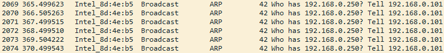

# CASE 01 — DNS Resolution Failure

## Problem
  Cannot Resolve a Website Domain

## Investigation
  IP configuration  ✓
  ```
  DHCP Enabled. . . . . . . . . . . : Yes
  Autoconfiguration Enabled . . . . : Yes
  Link-local IPv6 Address . . . . . : fe80::2e52:17e2:2c1f:41f8%4(Preferred)
  IPv4 Address. . . . . . . . . . . : 192.168.0.101(Preferred)
  Subnet Mask . . . . . . . . . . . : 255.255.255.0
  Default Gateway . . . . . . . . . : 192.168.0.1
  DHCP Server . . . . . . . . . . . : 192.168.0.1
  DNS Servers . . . . . . . . . . . : 192.168.0.250
  ...
  ```
  Gateway connectivity  ✓
  ```cmd
  Pinging 192.168.0.1 with 32 bytes of data:
  Reply from 192.168.0.1: bytes=32 time=3ms TTL=64
  Reply from 192.168.0.1: bytes=32 time=3ms TTL=64
  Reply from 192.168.0.1: bytes=32 time=3ms TTL=64
  ```
  Internet connectivity  ✓
  ```cmd
  Pinging 1.1.1.1 with 32 bytes of data:
  Reply from 1.1.1.1: bytes=32 time=18ms TTL=57
  Reply from 1.1.1.1: bytes=32 time=15ms TTL=57
  Reply from 1.1.1.1: bytes=32 time=15ms TTL=57
  ```
  DNS resolution ✗
  ```cmd
  > ping example.com
  Ping request could not find host example.com. Please check the name and try again.
  ```
  ```cmd
  > nslookup example.com
  DNS request timed out.
      timeout was 2 seconds.
  Server:  UnKnown
  Address:  192.168.0.250

  DNS request timed out.
      timeout was 2 seconds.
  ...
  *** Request to UnKnown timed-out
  ```

## Finding
  DNS server = 192.168.0.250

## Network Evidence
  

## Verification
  ```
  nslookup example.com 1.1.1.1
  ```
  ```
  Server:  one.one.one.one
  Address:  1.1.1.1

  Non-authoritative answer:
  DNS request timed out.
      timeout was 2 seconds.
  Name:    example.com
  Addresses:  104.20.23.154
              172.66.147.243
  ```

## Fix
  Restore valid DNS configuration or use a public DNS Resolver like `1.1.1.1` or `8.8.8.8`.

## Verification after fix
  ```
  > ping example.com

  Pinging example.com [172.66.147.243] with 32 bytes of data:
  Reply from 172.66.147.243: bytes=32 time=17ms TTL=58
  ...
  ```
  ```
  > nslookup example.com
 
  Server:  one.one.one.one
  Address:  1.1.1.1

  Non-authoritative answer:
  DNS request timed out.
      timeout was 2 seconds.
  Name:    example.com
  Addresses:  104.20.23.154
              172.66.147.243
  ```
